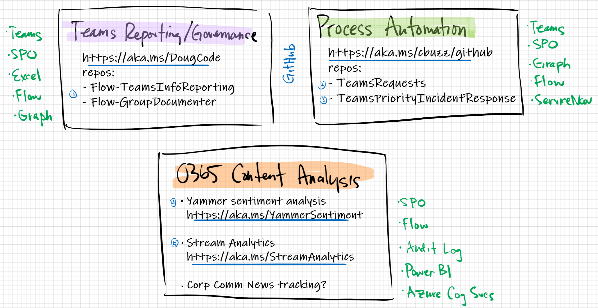
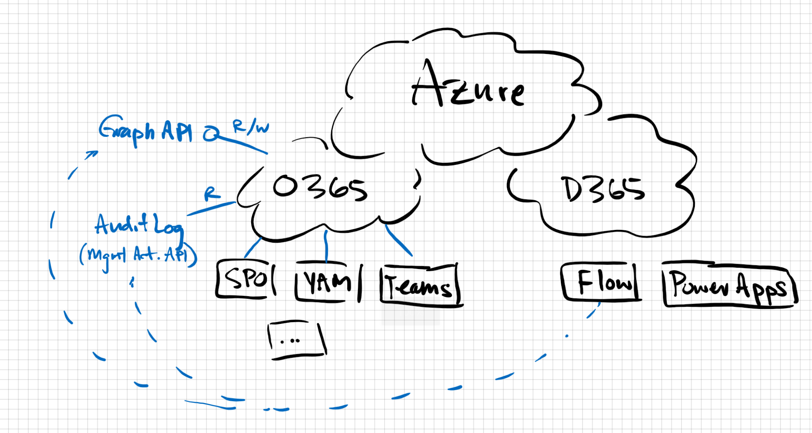
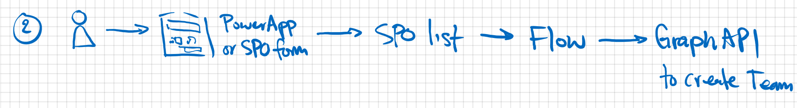
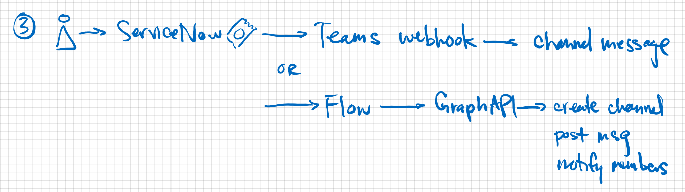
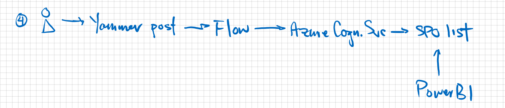

# MTC Open Hack

## Microsoft Graph

Home: https://developer.microsoft.com/en-us/graph

Getting Started: https://developer.microsoft.com/en-us/graph/get-started

Graph Explorer: https://developer.microsoft.com/en-us/graph/graph-explorer

Sample and Authorization Content: https://aka.ms/graphhack

## PowerApps/Flow/Power BI

### PowerApps and Flow
App in a Day presentation: https://aka.ms/aiadpresentation

### Power BI
  Dashboard in a Day course/lab: https://assetsprod.microsoft.com/mpn/en-us/diad.zip 
  
  Summary Microsoft Power BI documentation: https://powerbi.microsoft.com/en-us/
  
  Detailed Microsoft Documentation library:  https://docs.microsoft.com/en-us/power-bi/

## Advanced M365 admin task automation + auditing through Power BI, Graph APIs, PowerShell and more

### Teams Reporting/Governance
https://aka.ms/DougCode

#### repo: Flow-TeamsInfoReporting
#### repo: Flow-GroupDocumenter

### Process Automation
https://aka.ms/cbuzz/github
#### repo: TeamsRequests

#### repo: TeamsPriorityIncidentResponse

### O365 Content Analysis
#### Yammer sentiment analysis: https://aka.ms/YammerSentiment

#### Stream analytics: https://aka.ms/StreamAnalytics

### Power Platform Governance
 - Center of Excellence Starter Kit - https://aka.ms/coestarterkit
